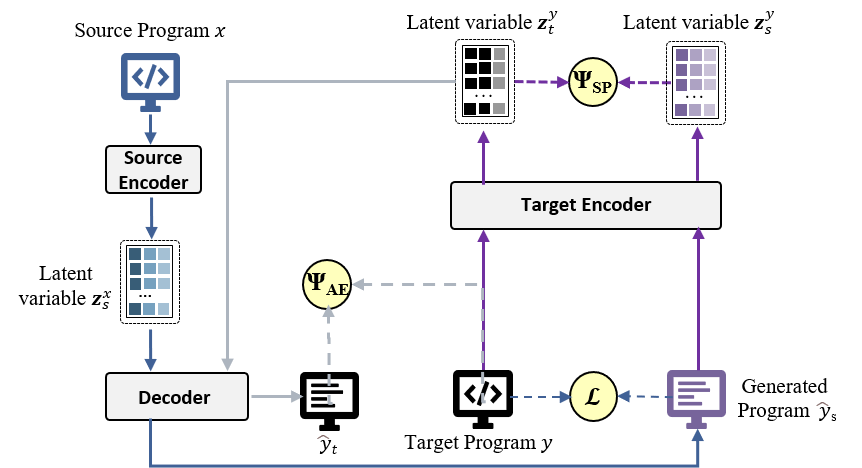

# PSSPT: Preserving Semantic Similarity for Program Translation

This repo has the PyTorch implementation and datasets of our ASE 2023 paper: PSSPT: Preserving Semantic Similarity for Program Translation

## Introduction
In this work, we propose a general framework to measure the semantic similarity between the predictions and reference, which is applicable to all supervised program translation neural networks (\textit{e.g,} LSTM, Transformer). We also evaluate Large Language Models (e.g, Codex) on the program translation. To evaluate the quality of the generated program, we perform the experiment with a number of metrics, including word-overlap similarity metrics and Execution-Based similarity metrics to test the runnability and executive correctness of the program translation. Extensive experiments prove that preserving the semantic similarity in program translation is essential and effective.


## Requirements
* Conda
  * install conda: [https://conda.io/projects/conda/en/latest/user-guide/install/index.html](https://conda.io/projects/conda/en/latest/user-guide/install/index.html)
  * create a new conda environment:
      * if you are running with GPU: 
        ```
        conda env create -f environment-gpu.yml
        conda activate mqmc
        ```
        Dependencies include support for CUDA_11.4. If you are using a different CUDA version update the dependencies accordingly.
      * if you are running with CPU:   
        ```
        conda env create -f environment-cpu.yml
        conda activate mqmc
        ```

## Example to Run the Codes 
The instruction of commands has been clearly stated in the codes.

* Java-C#
```
python run.py --model_type='roberta' --output_dir='saved_models/Java-C#/' --train_filename='../data/program_data/Java-C#/train-Java-C#-tok.cs,../data/program_data/Java-C#/train-Java-C#-tok.java,../data/map_data/C#-program-tok.jsonl,../data/program_data/Java-C#/train-C#-map.jsonl@' --test_filename='../data/program_data/Java-C#/test-Java-C#-tok.cs,../data/program_data/Java-C#/test-Java-C#-tok.java,../data/map_data/C#-program-tok.jsonl,../data/program_data/Java-C#/test-C#-map.jsonl' --train_snippet_filename=None --dev_snippet_filename=None --test_snippet_filename=None --source_lang='Java' --target_lang='C#' --max_source_length=512 --max_target_length=512 --max_comment_length=64 --do_train --do_eval --do_test --train_batch_size=128 --eval_batch_size=128 --learning_rate=0.0001 --beam_size=10 --weight_decay=0.0 --adam_epsilon=1e-08 --max_grad_norm=1.0 --num_train_epochs=200 --max_steps=-1 --eval_steps=-1 --train_steps=-1 --warmup_steps=0 --local_rank=-1 --seed=42 --temperature=2.0 --weightAB=1.0 --weightBB=2.0 --weightcon=3.0 --autonum=50
```

## Contact
If You find any problems or have any questions, please contact with me.


## Acknowledgments and Licenses
* The calculation of CodeBLEU in our work is adapted from CodeBLEU (https://github.com/microsoft/CodeXGLUE/).
* The public CosT dataset used in our work is from MuST-CoST (https://github.com/reddy-lab-code-research/MuST-CoST/)
* All license clauses are in the LICENSE file.
